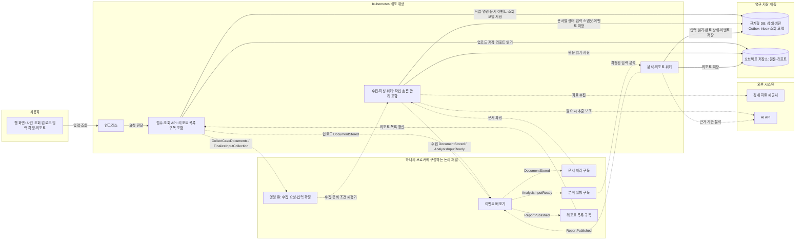
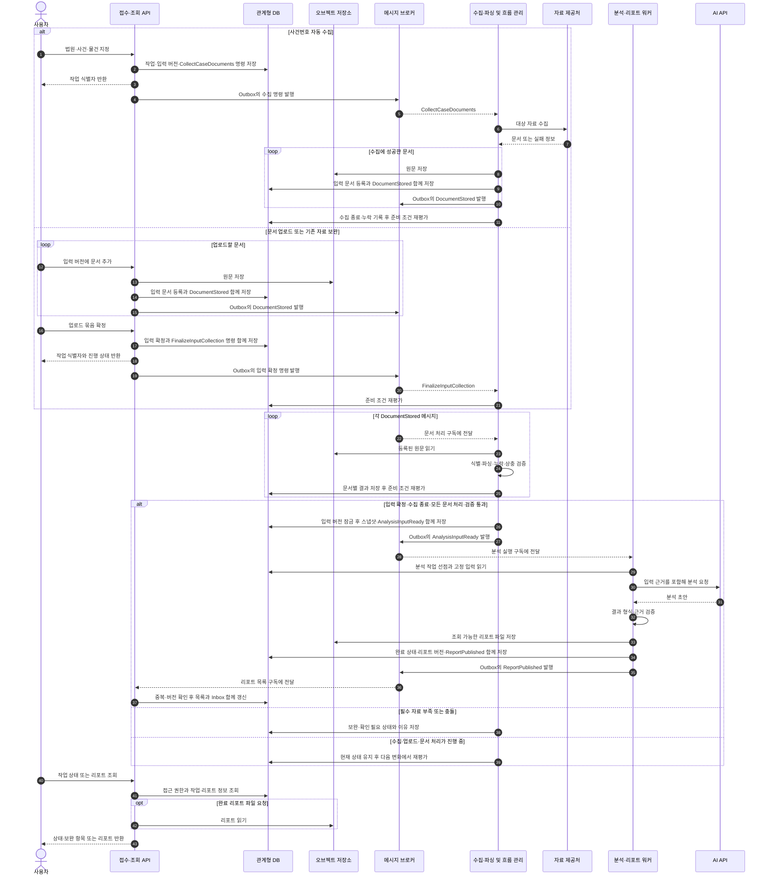
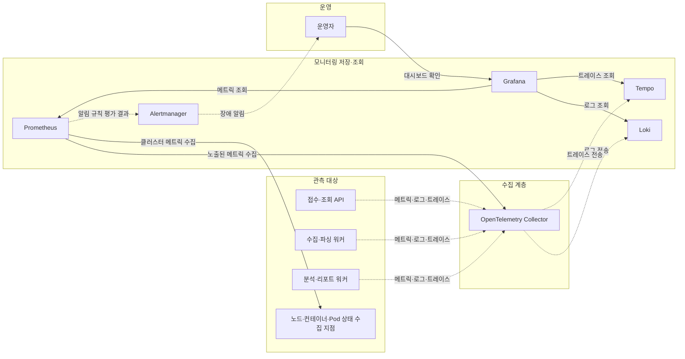

# 경매 권리 분석 서비스 아키텍처

> 설계 초안. 실제 구현이나 배포가 완료된 구성이 아니다. 두 입력 방식, 명령·이벤트를 구분한 비동기 처리, 모니터링, Kubernetes 배포를 목표로 한다.

## 1. 목표와 설계 범위

- 법원과 사건번호로 대상 물건을 선택해 자료를 자동 수집한다.
- 사용자가 문서를 직접 업로드하거나, 자동 수집한 자료를 업로드로 보완한다.
- 공통 파이프라인에서 원문을 파싱하고 검증한 뒤 AI 분석 결과를 근거가 포함된 리포트로 제공한다.
- 접수·조회와 오래 걸리는 작업을 격리하고, 실패한 작업을 저장된 중간 결과에서 재개한다.
- 메트릭·로그·트레이스를 수집하고 Kubernetes에서 배포·복구·확장을 실험한다.
- 리소스 절약을 위한 언어 변경은 동일한 부하에서 측정한 결과로 결정한다.

초기 제안은 세 개의 애플리케이션 배포 단위다. 입력, 수집, 파싱, 분석, 리포트라는 다섯 처리 단계가 각각 별도 서비스일 필요는 없다.

## 2. 전체 구성도

명령은 특정 작업을 요청하고, 이벤트는 이미 저장된 사실을 알린다. 초기 배포 단위는 세 개로 유지한다. 작업 흐름 관리 모듈은 수집·파싱 워커 안에 둔다.

실선은 요청 또는 저장소 접근, 점선은 비동기 메시징 또는 외부 연동이다. 명령 큐와 이벤트 배포기는 같은 브로커의 논리적 구성이며 별도 제품을 뜻하지 않는다. 저장소와 브로커의 운영 위치·제품은 미정이다.

| 배포 단위 | 명령 처리·이벤트 구독 | 상태와 발행 책임 |
|---|---|---|
| 접수·조회 API | HTTP 입력·조회, `ReportPublished` 구독 | 작업 접수·입력 확정, 업로드 `DocumentStored` 발행, 리포트 목록 갱신 |
| 수집·파싱 워커 | `CollectCaseDocuments`, `FinalizeInputCollection`, `DocumentStored` | 수집·파싱 상태, 입력 준비 조건 판단, 수집 `DocumentStored`와 `AnalysisInputReady` 발행 |
| 분석·리포트 워커 | `AnalysisInputReady` 구독 | 고정된 입력 분석, 리포트와 완료 상태 저장, `ReportPublished` 발행 |

브로커 발행은 상태 변경과 함께 기록한 Outbox를 통해 수행한다. 다이어그램의 발행 화살표에는 각 프로세스 내부 발행기의 처리가 포함된다.

DB를 공유하는 초기 구조에서도 테이블별 쓰기 책임은 위 표대로 나눈다. 리포트 생성 완료의 원본 상태는 분석 워커가 저장하고, API의 리포트 목록은 이벤트로 갱신하는 조회 모델이다. 목록 반영이 늦어져도 작업 상세에서는 원본 완료 상태를 조회한다.

후속 이메일 알림·통계 집계는 필요해질 때 `ReportPublished`에 별도 구독을 추가한다. 초기에는 새 알림 서비스나 별도 분석 완료 이벤트를 만들지 않는다.

## 3. 두 입력 경로와 공통 처리

시퀀스는 대표 흐름이다. 실제 문서 파싱은 수집·업로드와 병행될 수 있고, 입력 확정 명령이 문서 이벤트보다 먼저 도착할 수도 있다. 브로커 도착 순서가 아니라 DB에 기록된 입력 목록과 처리 상태로 준비 여부를 판단한다.

- 사건은 법원·사건번호로 식별하고 개별 매각 물건을 구분한다. 문서의 식별 정보가 불명확하면 사용자 확인을 받는다.
- 업로드 입력은 사용자가 묶음을 명시적으로 확정한다. 자동 수집 입력은 수집 시도 종료를 기록한다. 혼합 입력은 두 조건을 모두 확인한다.
- 입력 목록이 확정되고 자동 수집이 종료되며, 등록된 문서의 처리가 모두 끝나고 필수 항목·일치 여부가 검증되어야 분석한다. 해당하지 않는 입력 경로의 조건은 제외한다.
- 문서가 하나 파싱될 때마다 분석하지 않는다. 수집 종료·입력 확정·파싱 결과 저장마다 준비 조건을 재평가한다.
- 준비 조건 판단과 스냅샷 생성은 입력 버전 단위로 직렬화한다. `job_id + input_version`별 준비 이벤트의 논리적 생성은 한 번만 허용하되 전달 중복은 허용한다.
- 업로드 묶음 확정 전 진행 중인 업로드가 없는지 확인한다. 혼합 입력의 업로드 확정은 사용자 경로만 닫고, 자동 수집은 종료될 때까지 자료를 등록한다.
- 분석 준비 전환에서 봉인한 전체 입력 스냅샷에는 새 문서를 덧붙이지 않는다. 보완은 이전 문서를 참조하는 새 입력 버전을 만들고 같은 흐름으로 처리한다.
- 자동 수집 장애 중에도 업로드 경로는 동작한다. 필수 자료 부족을 자동으로 충족 처리하지 않는다.
- 문서 작성일·기준 시점과 출처를 보존하고 충돌을 드러낸다. 자료가 없다는 사실을 권리가 없다는 판단으로 바꾸지 않는다.

이벤트 계약과 구독별 처리 규칙은 [[경매 권리 분석 서비스 이벤트 설계]]에 정리한다. 개발 저장소에서는 [이벤트 설계 문서](https://github.com/jwj4016/auction-rights/blob/main/docs/event-driven-design.md)를 참고한다.

## 4. 상태와 신뢰성

작업 상태의 예시는 다음과 같다. 명칭과 세부 전이는 구현 시 확정한다.

| 상태 | 의미 | 후속 처리 |
|---|---|---|
| 접수됨 | 입력과 작업이 영구 저장됨 | 큐 발행 및 워커 처리 대기 |
| 수집 중·파싱 중 | 자료 확보 및 구조화 진행 | 중간 결과 저장 |
| 보완 필요·확인 필요 | 자료 누락 또는 대상·내용 충돌 | 업로드·확인 후 새 입력 버전 처리 |
| 분석 중·리포트 생성 중 | 검증된 입력을 분석하고 결과 작성 | 결과 검증 및 저장 |
| 완료 | 리포트가 저장되고 조회 가능함 | 새 자료가 오면 새 분석 버전 생성 |
| 재시도 대기 | 일시적 오류로 다음 시도 예약 | 횟수·기한 제한 내 재개 |
| 실패 | 자동 복구 한도 초과 또는 복구 불가 오류 | 원인 확인 후 명시적 재처리 |

### 작업 유실과 중복 방지

- 상태 변경과 후속 명령·이벤트는 같은 DB 트랜잭션으로 Outbox에 저장한다. 업무 상태는 DB에 유지하며 이벤트 소싱은 도입하지 않는다.
- 이벤트 발행기는 각 생산 프로세스의 백그라운드 작업으로 시작한다. DB 트랜잭션을 종료한 뒤 큐의 발행 확인을 받고 발행 상태를 갱신한다.
- 큐 발행 확인과 DB 갱신 사이에 종료되면 중복 발행될 수 있다. 전달은 최소 한 번을 전제로 설계한다.
- 작업 식별자·단계·입력 버전에 고유 제약과 원자적 작업 선점을 적용한다. 처리 중 종료된 작업은 임대 만료 후 재개하며 오래된 실행이 최신 결과를 덮어쓰지 못하게 한다.
- 중간 결과·후속 Outbox·소비 완료 Inbox를 필요한 범위에서 원자적으로 저장한 뒤 메시지 처리를 확인한다. 긴 외부 호출은 트랜잭션 밖에서 수행하고, 수신 사실만으로 소비 완료를 표시하지 않는다.
- Inbox는 구독자 이름과 메시지 식별자로 중복을 막는다. 별도 이벤트로 같은 작업이 요청되는 경우에는 문서·입력 버전 기반 업무 고유 제약으로 막는다.
- 메시지에는 원문 대신 식별자·스키마 버전·추적 문맥을 전달한다. 순서 역전은 버전과 DB 상태로 처리하며, 이전 리포트 이벤트가 최신 목록을 덮어쓰지 않도록 한다.
- 파일 저장과 DB 저장은 하나의 트랜잭션이 아니다. 임시 업로드의 완료 여부를 확인하고, 연결되지 않은 파일은 유예 기간 후 정리한다.
- 외부 AI가 요청을 처리한 뒤 응답만 유실될 수 있다. 제공자의 멱등성 지원을 확인하고, 재시도 한도·호출 이력·비용 상한으로 중복 비용을 통제한다.
- 외부 API 호출 동안 DB 트랜잭션이나 연결을 장시간 점유하지 않는다.

### 장애 격리

- 외부 호출별 타임아웃, 동시 실행 제한, 제공자별 호출 한도를 둔다.
- 일시적 오류는 지수 백오프와 임의 지연으로 제한적으로 재시도한다. 잘못된 입력은 무한 재시도하지 않는다.
- 반복 실패 작업은 실패 큐 또는 영구 실패 기록으로 격리하고, 원인과 재처리 이력을 남긴다.
- 큐 장애 시 접수 데이터가 DB에 저장되면 발행 대기 상태로 유지한다. 적체 한도를 넘으면 신규 접수를 제한한다.
- 외부 제공처 장애 중 기존 리포트 조회는 유지할 수 있지만 새 분석 완료는 지연될 수 있다.
- DB·오브젝트 저장소 장애까지 애플리케이션 분리만으로 해결되지는 않는다.

## 5. 모니터링 구성도

다음은 목표 구성이다. 메트릭 수집부터 도입하고 로그·트레이스를 순차적으로 연결한다. 로그 본문에 문서 원문이나 인증정보를 기록하지 않는다.

클러스터 메트릭 수집 지점은 kubelet의 컨테이너 메트릭, 노드 메트릭 수집기, kube-state-metrics 등의 논리적 묶음이다. 실제 배포 컴포넌트는 구현 시 확정한다.

| 영역 | 우선 지표 |
|---|---|
| 사용자 경험 | 접수 성공률, 리포트 완료율, 접수부터 완료까지의 시간 |
| 명령·이벤트 | 구독별 대기 수·최대 대기 시간, 재시도·실패 수, Outbox 지연, 중복 차단 수, 리포트 목록 반영 지연 |
| 수집·파싱 품질 | 제공처별 실패율, 문서 종류별 추출 실패, 보완·충돌 비율 |
| AI 분석 | 호출 지연, 오류, 토큰 사용량·비용, 근거 검증 실패 |
| 리소스 | 프로세스 CPU·메모리, 재시작·OOM, DB 연결 수, 저장소 잔여량 |

- HTTP와 큐 메시지에 추적 문맥을 전파한다. 재처리는 이전 시도와 연결하고 영구 작업 식별자로 조회 가능하게 한다.
- 작업·사건 식별자는 로그·트레이스에 사용하되 메트릭 라벨에는 넣지 않는다.
- 모델·프롬프트·파서·규칙 버전과 입력 문서 버전을 기록해 결과의 변경 원인을 추적한다.
- 접수 성공률과 분석 완료율을 분리해, 접수만 되고 작업이 멈춘 상태를 감지한다.
- 모니터링 저장소의 보관 기간과 디스크 사용량도 제한하고 관측 시스템 자체 장애를 확인한다.

## 6. Kubernetes 배포와 가용성

- 세 애플리케이션을 각각 Deployment로 배포하고 독립적인 리소스 요청·제한과 복제본 수를 설정한다.
- 인그레스는 접수·조회 API에만 연결한다. 워커와 데이터 계층은 외부에 직접 노출하지 않는다.
- 정상 종료 시 새 작업 수신을 멈추고 실행 중 작업의 상태를 저장한다. 종료 기한을 넘기면 다른 워커가 재개한다.
- 시작·준비·생존 상태 검사를 구분한다. 외부 AI 일시 장애만으로 프로세스를 계속 재시작하지 않는다.
- 워커 증설은 큐 대기 시간과 외부 API 허용량을 함께 본다. 복제본 증가로 제공자 제한을 넘지 않게 한다.
- 영구 데이터는 Pod 로컬 파일시스템에 의존하지 않는다. PVC 또는 외부 저장소의 백업·복구를 별도로 검증한다.
- 단일 노드에서는 프로세스 복구를 실험한다. 노드 장애에 대한 고가용성을 주장하지 않는다.
- 실제 고가용성은 다중 노드 분산, 충분한 여유 용량, DB·큐·저장소·제어 평면의 복구 설계를 함께 다룬다.

## 7. 기술 선택 상태

| 항목 | 현재 상태 |
|---|---|
| 언어 | Java·Spring Boot 기준 구현 제안. Go·Python 전환은 측정 후 결정 |
| 저장소 구성 | 관계형 DB + 오브젝트 저장소. 제품과 운영 위치 미정 |
| 비동기 처리 | 명령 큐 + 내구성 있는 이벤트 구독. Outbox·Inbox 적용, 브로커 제품 미정 |
| AI | 외부 API 호출 전제의 초안. 제공자·모델·입력 보관 조건 미정 |
| 자동 수집 | 문서별 제공처·API 지원·인증·비용·이용 조건 확인 필요 |
| 사용자 화면 | 사건 조회, 문서 업로드, 보완 안내, 진행 상태, 리포트 조회. 프레임워크 미정 |
| 배포 | Kubernetes 목표. 로컬 개발 환경은 언어 선정 후 구성 |
| 관측성 | OpenTelemetry, Prometheus, Loki, Tempo, Grafana, Alertmanager 목표 |

리소스 비교는 동일한 문서·동시 처리량에서 최대 메모리, CPU 사용량, 처리 시간, 실패율, 전체 비용을 측정한다. 프로세스 기본 사용량·DB 연결·관측 시스템·외부 AI 비용을 포함하며, 언어 변경만으로 절약을 보장하지 않는다.

## 8. 첫 검증 범위

- [ ] 자동 수집할 문서별 확보 경로와 조건 확인
- [ ] 검토된 학습용 사례와 기대 추출 결과 준비
- [ ] 두 입력 경로가 동일한 문서·입력 스냅샷 구조로 합류
- [ ] 자동 수집 실패를 업로드로 보완하고 새 버전 분석
- [ ] 분석 결과에서 원문 근거와 미확인 사항 확인
- [ ] 워커 강제 종료 후 작업 유실 없이 재개
- [ ] 문서 여러 개 업로드 중 조기 분석이 시작되지 않음 확인
- [ ] 입력 확정·문서 이벤트 순서 역전에도 분석 준비 상태로 수렴
- [ ] 중복 이벤트 처리 후 분석·리포트·상태 중복 없음 확인
- [ ] 이전 입력 버전 이벤트가 최신 리포트 목록을 덮어쓰지 않음 확인
- [ ] 리포트 목록 구독 장애 중 완료 리포트 상세 조회 유지
- [ ] 외부 API 장애 중 기존 리포트 조회 유지
- [ ] 메트릭·로그·트레이스로 실패 단계 추적

## 참고 자료

- [법제처: 경매 물건과 자료 확인](https://www.easylaw.go.kr/CSP/CnpClsMainBtr.laf?ccfNo=2&cciNo=2&cnpClsNo=1&csmSeq=306)
- [법원 사법정보공유포털](https://openapi.scourt.go.kr/kgso000m02.do)
- [AWS: 재시도와 멱등성](https://aws.amazon.com/builders-library/making-retries-safe-with-idempotent-APIs/)
- [OpenTelemetry: 추적 문맥 전파](https://opentelemetry.io/docs/concepts/context-propagation/)
- [Kubernetes: 장애 대응](https://kubernetes.io/docs/concepts/workloads/pods/disruptions/)
- [NIST: 생성형 AI 위험 프로필](https://nvlpubs.nist.gov/nistpubs/ai/NIST.AI.600-1.pdf)

- [Microsoft: 명령과 이벤트 메시징](https://learn.microsoft.com/en-us/azure/architecture/guide/technology-choices/messaging)
- [Transactional Outbox 패턴](https://microservices.io/patterns/data/transactional-outbox.html)
